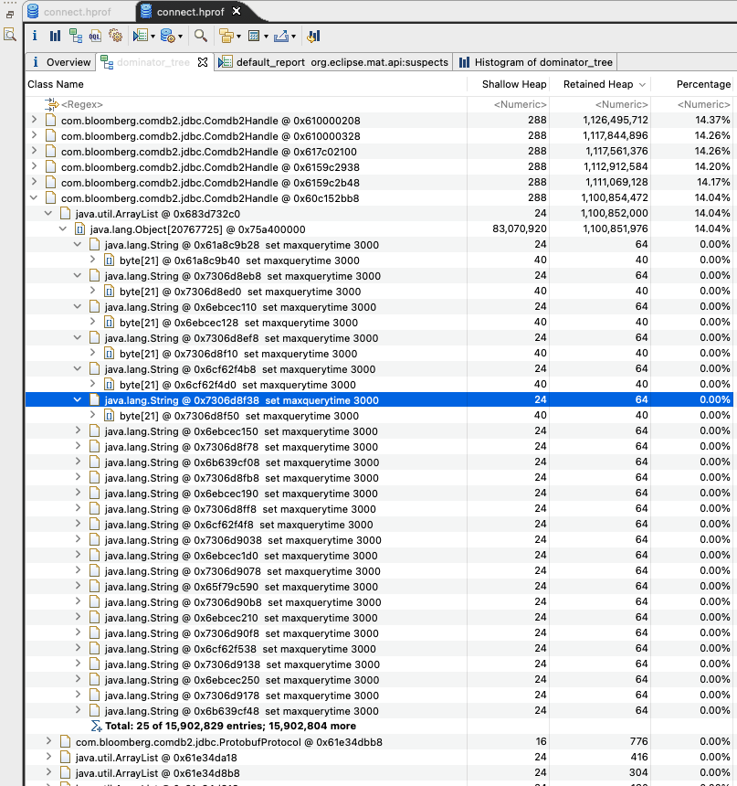

# Comdb2 JDBC Driver's OOM Sample Project
This project showcases an issue we encounter when setting some JDBC parameters (query timeout in particular) 
in a long-lived application.

## Context
Each instance of a `com.bloomberg.comdb2.jdbc.Comdb2Connection` connection object creates an [internal
Comdb2Handle](https://github.com/bloomberg/comdb2/blob/master/cdb2jdbc/src/main/java/com/bloomberg/comdb2/jdbc/Comdb2Connection.java#L89) 
instance that is used to communicate with the database. 

This `Comdb2Handle` instance is reused throughout the connection's lifecycle. This means that every `com.bloomberg.comdb2.jdbc.Statement` 
created when calling `connection.createStatement()`/`connection.prepareStatement(...)` takes a reference of the 
connection's `Comdb2DbHandle` as a constructor argument, and uses it to execute the statement.

The `Comdb2Handle` maintains a [List<String>](https://github.com/bloomberg/comdb2/blob/master/cdb2jdbc/src/main/java/com/bloomberg/comdb2/jdbc/Comdb2Handle.java#L96) of all
the `set` SQL statements that must be executed as part of any Statement. A few common uses of the `set` command are:
* Specifying the [username/password](https://github.com/bloomberg/comdb2/blob/master/cdb2jdbc/src/main/java/com/bloomberg/comdb2/jdbc/Comdb2Handle.java#L230) to connect to the database
* Setting timeouts (query timeout, connection timeout, etc)
* Setting up [retries](https://github.com/bloomberg/comdb2/blob/master/cdb2jdbc/src/main/java/com/bloomberg/comdb2/jdbc/Comdb2Handle.java#L332), [query effects](https://github.com/bloomberg/comdb2/blob/master/cdb2jdbc/src/main/java/com/bloomberg/comdb2/jdbc/Comdb2Handle.java#L385) and other properties.

These commands are set either at the `Comdb2Connection` or `Comdb2Statement` level. 

## Problem Statement
Because the `Comdb2Handle` is created per `Comdb2Connection` and reused across all statements, there's
a potential for the `List<String>` of `set` commands to grow unbounded and cause Out Of Memory errors on the
underlying JVM. This is not a theoretical problem: we've encountered this issue when running the latest `2.6.0` version
of the JDBC driver.


This is a heap capture from a running JVM showing the large amount of memory (over 6GB) of just `java.lang.String` references
kept by the `Comdb2Handle` internal `List<String> set` field.

## How to reproduce this issue
### Pre-requisites
* JDK 11 + Apache Maven
* Docker
* Access to a Comdb2 docker image (I'm using an internally built *artprod.dev.bloomberg.com/comdb2:latest* image)

### To run
```shell
$ mvn clean verify
```

The [Comdb2StatementIT](./src/test/java/comdb2/test/oom/Comdb2StatementIT.java) test has 2 tests (one reusing the same `java.sql.Statement`, 
and the other creating new `java.sql.Statement` per iteration), each one showing the undesired behavior.
